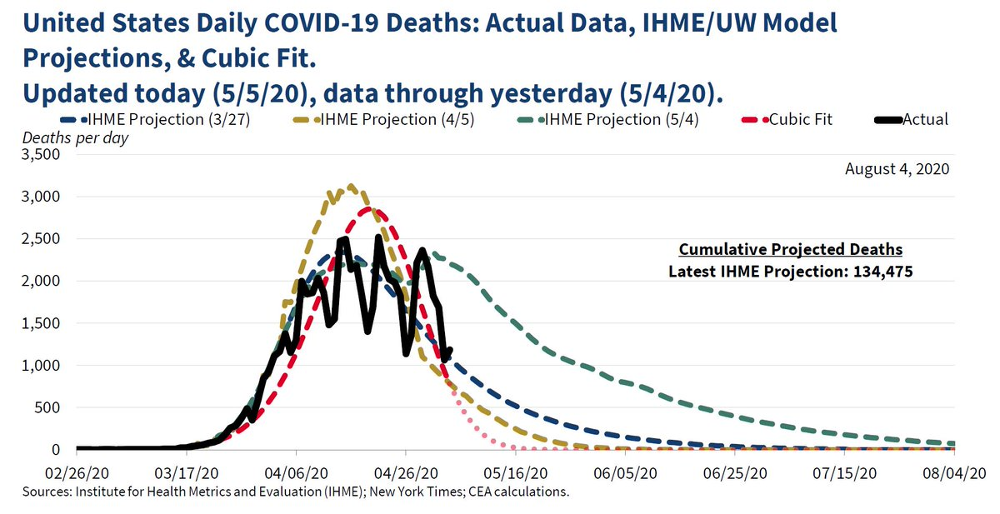

```{r setup, include=FALSE}
knitr::opts_chunk$set(echo = TRUE)
```

Andrew Gelman commented on Cosma's anaysis today.

Here is Cosma's analysis

> How Not to Fit a Trend

> If one of The Kids in Data Over Space and Time turned in something
> like this, I'd fail them ask where I'd gone wrong patiently talk them
> through all the reasons why blind, idiot curve-fitting is, in fact,
> idiotic, especially for extrapolating into the future. If they told me
>
> > well, I fit a cubic polynomial to the log of the series,
>
> we would go over why that is, still, blind, idiot curve-fitting.


```{r cosmaFit, message=FALSE, comment=NA}
library("covid19.analytics")

temp <- covid19.data("ts-deaths-US")
cu_deaths <- colSums(temp[,-(1:4)])
deaths <- c(0,diff(cu_deaths))
covid <- data.frame(cu_deaths,
                    deaths,
                    date=as.Date(names(cu_deaths)))
rownames(deaths) <- c()
plot(deaths ~ date, data=covid, type="l",
     lty="solid",
     ylim=c(0,3500),
     xlim=c(min(covid$date),
            as.Date("2020-08-04")),
     lwd=3)
start.date <- "2020-03-01"
working.data <- covid[covid$date>start.date,]
cubic <- lm(log(deaths) ~ poly(date, 3),
            data=working.data)
lines(x=working.data$date,
      y=exp(fitted(cubic)),
      col="red", lty="dashed", lwd=3)
future.dates <- seq(from=max(working.data$date),
                    to=as.Date("2020-08-04"),
                    by=1)
lines(x=future.dates,
      y=exp(predict(cubic,
                    newdata=data.frame(date=future.dates))),
      lty="dotted", col="pink", lwd=3)
```

> Of course, by reinforcing one of the most basic lessons about time
> series, I'd evidently be depriving them of the chance to join the
> [Council of Economic Advisors to the President of the United States](https://www.whitehouse.gov/cea/):

> I had always imagined that if we fell to pieces, it would be because
> we did something clever but deeply unwise. It is very depressing to
> realize that we may well end ourselves through sheer incompetence.



Andrew continues:

> Cosma’s data are slightly different from those in the government graph,
> but they give the same statistical story.
> 
> Its been a couple weeks so I’ll redo the graph running Cosma’s code on
> current data (making a few changes in display choices):

```{r andrewExtension}
library("covid19.analytics")

temp <- covid19.data("ts-deaths-US")
cu_deaths <- colSums(temp[,-(1:4)])
deaths <- c(0,diff(cu_deaths))
covid <- data.frame(cu_deaths,
                    deaths,
                    date=as.Date(names(cu_deaths)))
rownames(deaths) <- c()
plot(deaths ~ date, data=covid, type="l",
     lty="solid",
     ylim=c(0,3500),
     xlim=c(min(covid$date),
            as.Date("2020-09-01")),
     lwd=3)
start.date <- "2020-03-01"
working.data <- covid[covid$date>start.date,]
cubic <- lm(log(deaths) ~ poly(date, 3),
            data=working.data)
lines(x=working.data$date,
      y=exp(fitted(cubic)),
      col="red", lty="dashed", lwd=3)
future.dates <- seq(from=max(working.data$date),
                    to=as.Date("2020-09-01"),
                    by=1)
lines(x=future.dates,
      y=exp(predict(cubic,
                    newdata=data.frame(date=future.dates))),
      lty="dotted", col="pink", lwd=3)

```

Whoa! What happened?

But, yes, of course! A third-degree polynomial doesn’t just go up, then
down. It goes up, then down, then up. Here’s the fitted polynomial in
question:

```{r summaryCubic, comment=NA}
summary(cubic)
```

The coefficient of x^3 is positive, so indeed the function has to blow
up to infinity once x is big enough. (It blows up to negative infinity
for sufficiently low values of x, but since we’re exponentiating to get
the prediction back on the original scale, that just sends the fitted
curve to zero.)

When I went back and fit the third-degree model just to the data before
5 May, I got this:

```

                            coef.est coef.se
(Intercept)                  5.57     0.07  
poly(weeks_since_apr_1, 3)1 17.97     0.52  
poly(weeks_since_apr_1, 3)2 -8.54     0.52  
poly(weeks_since_apr_1, 3)3 -0.97     0.52  
---
n = 63, k = 4
residual sd = 0.52, R-Squared = 0.96
```

Now the highest-degree coefficient estimate is negative, so the curve
will continue declining to 0 as x increases. It would retrospectively
blow up for low enough values of x, but this is not a problem as we’re
only going forward in time with our forecasts.


